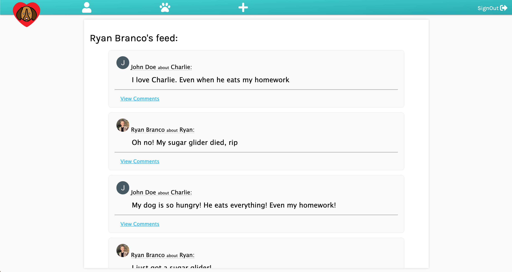

# Pet Matcher

Pet Matcher is a social media app for you and your pets!

Add all of your pets to your pet list and begin socializing with other people and their pets!

Technologies used: 
1. HTML
2. CSS
3. Node.JS
4. Express
5. MongoDB

Future additions:
1. Add messaging
2. You can click on a user and view their profile and pets
3. Likes and dislikes
4. Implement users uploading pictures

[Trello Board](https://trello.com/b/jm3l5SHd/project-2-planning)

Demo the app: [Pet Matcher](https://pet-datting-app.herokuapp.com/)

Screenshots:

