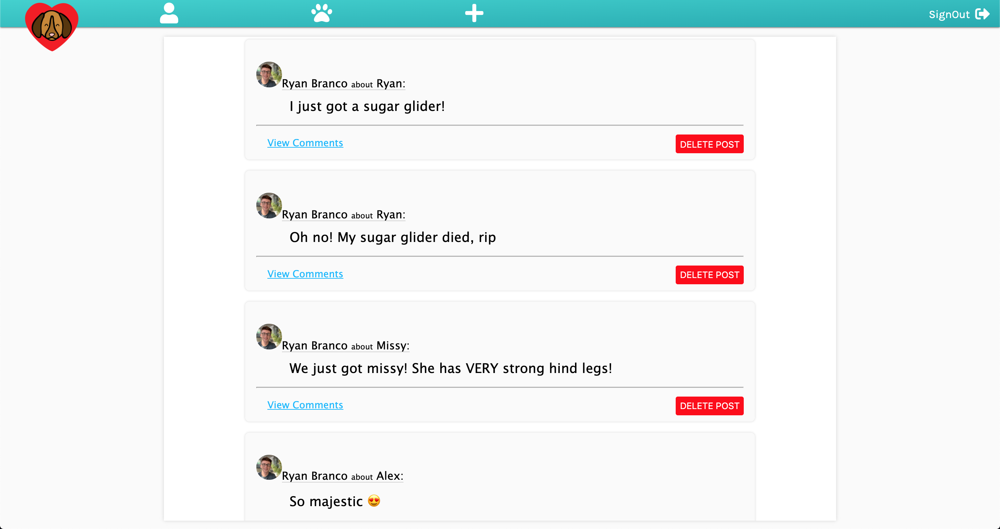

# Pet Matcher

Pet Matcher is a social media app for you and your pets!

Add all of your pets to your pet list and begin socializing with other people and their pets!

* Technologies used: 
    * HTML
    * CSS
    * Node.JS
    * Express
    * MongoDB

* Future additions:
    * Add messaging
    * You can click on a user and view their profile and pets
    * Likes and dislikes

[Trello Board](https://trello.com/b/jm3l5SHd/project-2-planning)

Demo the app: [Pet Matcher](https://pet-datting-app.herokuapp.com/)

Screenshots:

